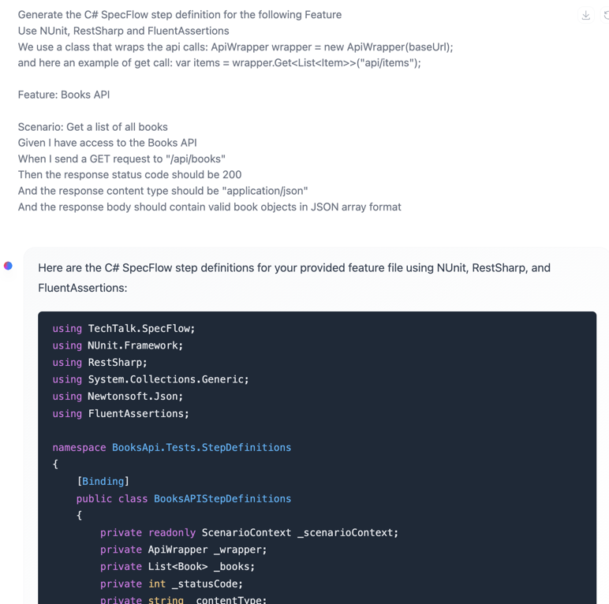

Generate the C# SpecFlow step definition for the following Feature
Use NUnit, RestSharp and FluentAssertions
We use a class that wraps the api calls: 

ApiWrapper wrapper = new ApiWrapper(baseUrl);

and here an example of get call: 
var items = wrapper.Get<List<Item>>("api/items");

Feature file=

Feature: Books API

Scenario: Get a list of all books
Given I have access to the Books API
When I send a GET request to "/api/books"
Then the response status code should be 200
And the response content type should be "application/json"
And the response body should contain valid book objects in JSON array format

